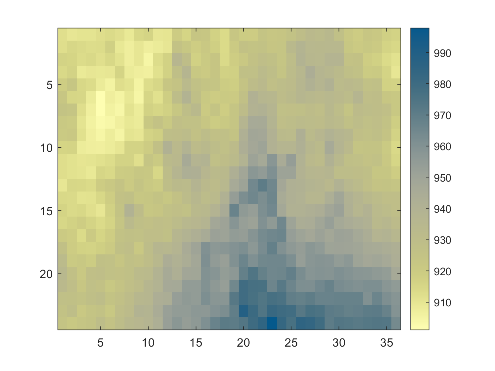

# TerraClimate-import-MATLAB
Short script for downloading time-series, maps and more from TerraClimate (http://www.climatologylab.org/terraclimate.html). For example, see the time-averaged precipitation map below. TerraClimate has global climate data at ~4km spatial and monthly temporal resolution, for the years 1958-2019.

This is a convenient way of getting climate data into a usable format. The script can be used to download data from anywhere on earth, in the form of 3D data arrays (lat x long x time), 2D time averaged maps (lat x long) and 1D spatially averaged time series (time).

The datasets that can be accessed are:
    aet (Actual Evapotranspiration, monthly total)
    def (Climate Water Deficit, monthly total)
    pet (Potential evapotranspiration, monthly total)
    ppt (Precipitation, monthly total)
    q (Runoff, monthly total)
    soil (Soil Moisture, total column - at end of month)
    srad (Downward surface shortwave radiation)
    swe (Snow water equivalent - at end of month)
    tmax (Max Temperature, average for month)
    tmin (Min Temperature, average for month)
    vap (Vapor pressure, average for month)
    ws (Wind speed, average for month)
    vpd (Vapor Pressure Deficit, average for month)
    PDSI (Palmer Drought Severity Index, at end of month)
    
The datasets may either be loaded into MATLAB (use terraclimate_fetch) or downloaded directly onto your computer as a geotiff or .csv (terraclimate_write).

To load data into MATLAB, the syntax is the following:
[vals,time] = terraclimate_fetch(lat_bounds,lon_bounds,years,months,var,((averaging)));

or to download directly to your laptop:

terraclimate_fetch(folder,filename,lat_bounds,lon_bounds,years,months,var,averaging);

or for example

[vals,time] = terraclimate_fetch([50 51.5],[-75.5 -74.5],[2000 2015],[1 12],'ppt','timeseries');
 
 The above will load into your MATLAB workspace a precipitation timeseries from Jan 2000 to Dec
 2015, spatially averaged over the region 50 to 51.5 N latitude, -75.5 to -74.5 W
 longitude.
 
 The script is well commented, and you can type
 
 'help terraclimate_fetch'
 
 or 
 
 'help terraclimate_write'
 
 into MATLAB's command line for more information.
